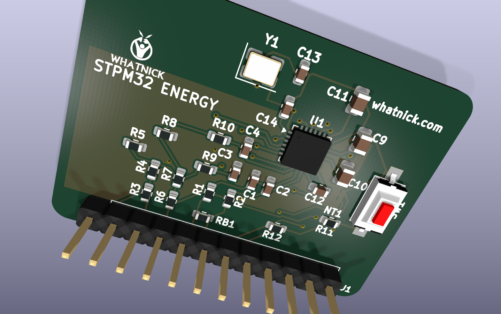
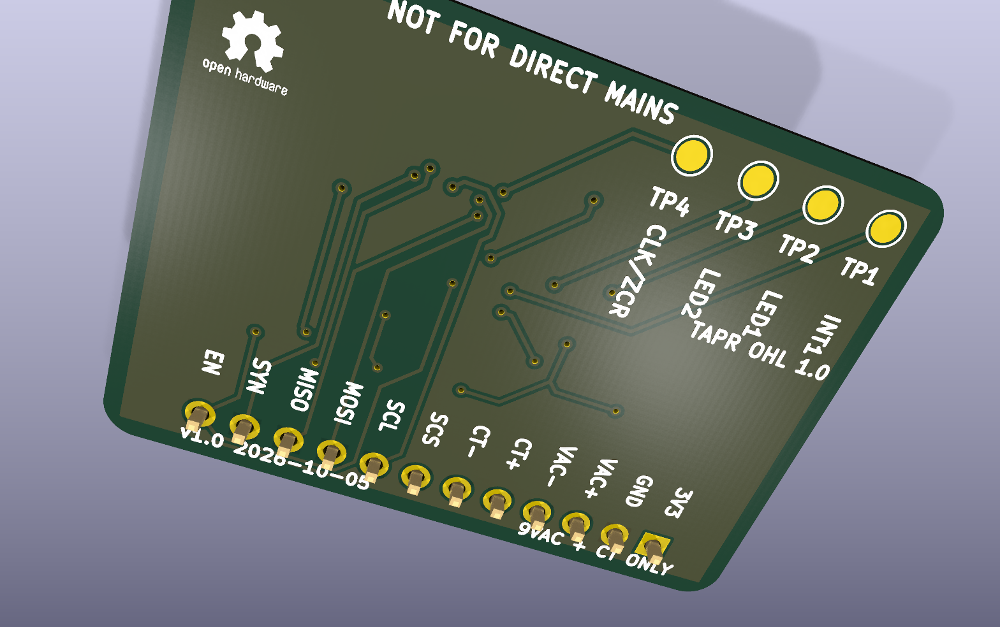

# STPM32 breakout

Compact KiCad 10 development board for the single-voltage, single-current
STMicroelectronics STPM32 energy-metering ASIC.

## 3D renders





## Implemented front end

- **Current input:** 100 A:50 mA current-output CT.
- **Burden:** 2.4 ohm differential, producing 120 mV RMS at 100 A.
- **Current filter:** 100 ohm series and 330 nF shunt on each differential leg,
  approximately 4.8 kHz.
- **Voltage input:** isolated 9 VAC transformer secondary.
- **Voltage divider:** 200 kohm / 2.49 kohm on each conductor, approximately
  81.3:1 differential scaling.
- **Voltage filter:** 1 kohm series and 33 nF shunt on each differential leg,
  approximately 4.8 kHz.
- **Clock:** 16 MHz crystal with 15 pF load capacitors.
- **Interface selector:** STPM32 supports SPI and UART, not I2C. SJ1 is a
  three-pad solder jumper with pads 1-2 closed by default, weakly pulling SCS
  low through R12 for SPI. For UART, cut the 1-2 bridge and solder 2-3 so R12
  weakly pulls SCS high. The resistor preserves host control of SCS in SPI mode.

At 9 VAC differential input, the voltage channel receives approximately
111 mV RMS, or 157 mV peak. Both analog channels remain below the STPM32
maximum differential input of +/-300 mV at their stated full-scale inputs.

## Breadboard header

| Pin | Signal | Pin | Signal |
|---:|---|---:|---|
| 1 | +3V3 | 7 | SCS |
| 2 | DGND | 8 | SCL |
| 3 | VAC_P | 9 | MOSI/RXD |
| 4 | VAC_N | 10 | MISO/TXD |
| 5 | CT_P | 11 | SYN |
| 6 | CT_N | 12 | EN |

INT1, LED1, LED2, and CLKOUT/ZCR are available on underside test pads.

## Mechanical and validation status

- 38.2 x 28.04 mm rounded board.
- Single long-edge 1x12, 2.54 mm header.
- No screw terminals, audio jacks, or direct-mains connector.
- Routed two-layer PCB with separate AGND and DGND pours joined through the
  three-pad analog/reference/digital ground net tie.
- Production silkscreen uses 0.8 x 0.8 mm component and signal labels with
  0.2 mm stroke, project-local Whatnick and OSHW logos, and explicit revision
  and build-date marking.
- U1 uses the project-local
  `models/step/STPM32_VQFN24_4x4_EP2.45.step` model. It matches the 4 x 4 mm,
  1.0 mm-high, 0.5 mm-pitch VQFN-24 envelope and nominal 2.45 x 2.45 mm
  exposed pad instead of relying on the missing similarly named KiCad library
  model. Geometry and orientation were cross-checked against ST's
  `STPM32.STEP` vendor model dated 2024-01-25; the vendor file is not
  redistributed.
- ERC: zero violations.
- DRC: zero violations and zero unconnected pads.

Regenerate the model and committed renders with:

```powershell
python -m pip install cadquery
python .\scripts\create_stpm32_qfn_step.py
python .\scripts\render_stpm32.py
```

## Gerber fabrication package

Generate the KiCad 10 fabrication outputs with:

```powershell
python .\scripts\generate_stpm32_gerbers.py
```

The script runs ERC and DRC before exporting the two copper layers, solder
masks, front and rear silkscreens, front paste, board outline, separate
plated/non-plated Excellon drill files, and front/rear component position CSV
files. Outputs are written to:

- `hardware/STPM32_Breakout/gerber/`
- `hardware/STPM32_Breakout/gerber/STPM32_Breakout_Gerbers.zip`

Upload the ZIP through Elecrow's PCB manufacturing web form. Elecrow does not
currently document a public PCB order or Gerber-upload API, so no account
credentials are required by this repository.

## Elecrow assembly BOM

The initial production selection uses exact manufacturer part numbers and LCSC
catalog identifiers so Elecrow can quote turnkey sourcing without substituting
parts from value-only descriptions. Precision 0.1%, 25 ppm/C resistors are
specified for the voltage-divider ratios; the remaining resistors are 1%.
Filter capacitors use X7R dielectric, crystal load capacitors use C0G, and the
16 MHz crystal is specified for 12 pF load capacitance. The selected 2.4 ohm
burden is suitable for development builds; use a lower-TCR burden selection
before claiming calibration-grade temperature stability.

Apply the sourcing metadata and regenerate the quote BOM with:

```powershell
python .\scripts\apply_stpm32_bom.py
```

The generated file is:

- `manufacturing/STPM32_Breakout_Elecrow_BOM.csv`

Assembly notes:

- U1 and all other SMT parts are intended for Elecrow placement.
- J1 is the only THT line and should be quoted separately; confirm that the
  fitted pin protrusion is suitable for breadboard use.
- TP1-TP4 and NT1 are PCB features, not purchasable components, and are
  excluded from the schematic BOM and placement outputs.
- Whatnick and OSHW logo footprints are excluded from BOM and placement files.
- Verify live stock, pricing, and approved substitutions when requesting each
  production quote.

## Safety

The voltage input is for an isolated 9 VAC transformer secondary only. This
development board is not a certified isolation barrier and must never be
connected directly to mains.
