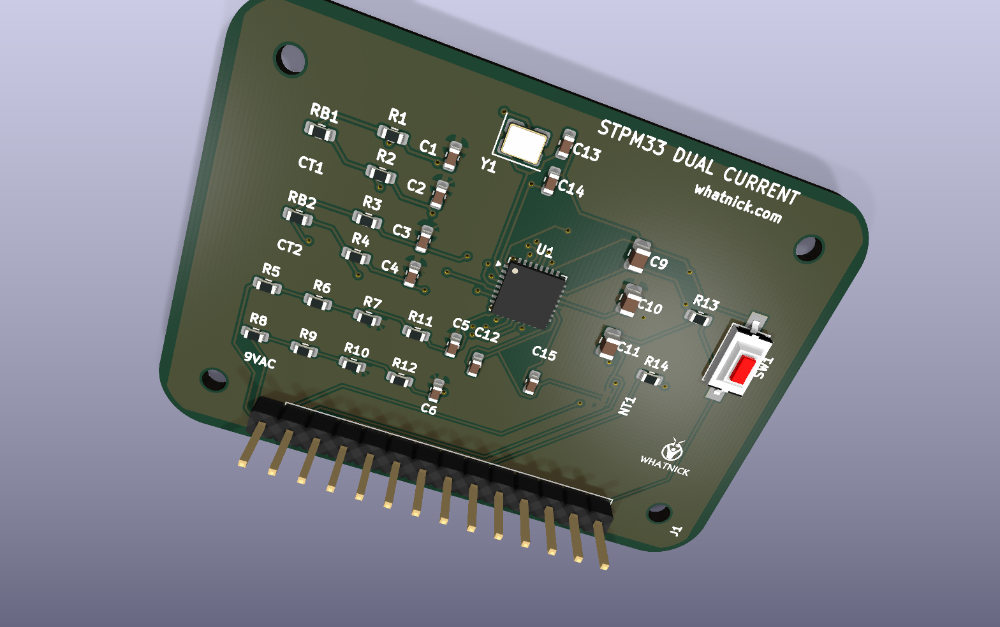
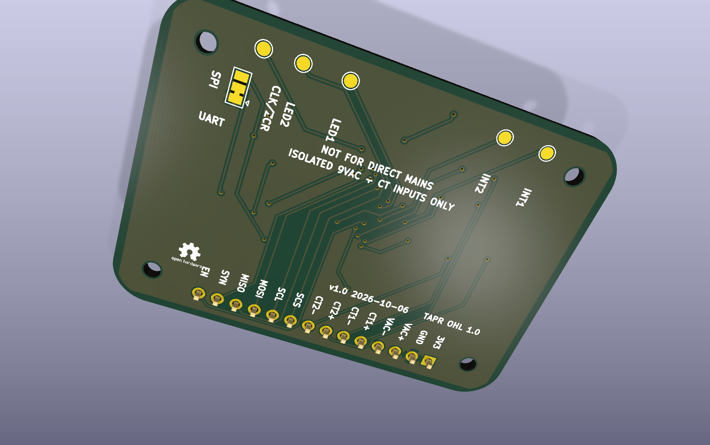

# STPM33 Breakout

KiCad 10 open-hardware breakout for the STMicroelectronics STPM33 metering
ASIC. It measures one isolated voltage channel and two current-transformer
channels, making it useful for phase/neutral comparison, tamper detection, and
two-current experiments sharing one voltage reference.





## Front end

- Supply: 3.3 V.
- Voltage input: isolated 9 VAC transformer secondary only.
- Current inputs: two 100 A:50 mA CTs.
- Current burdens: 2.4 ohm differential, giving 120 mV RMS at 100 A.
- Current filters: 100 ohm series resistors and 330 nF capacitors.
- Voltage divider: symmetric 200 kohm / 2.49 kohm legs.
- Voltage filters: 1 kohm series resistors and 33 nF capacitors.
- Clock: 16 MHz crystal.
- Grounding: separate GNDA and DGND pours joined through NT1.

This is not an isolated mains-input board. Connect only isolated low-voltage
sources and follow applicable electrical-safety practices.

## J1 pin map

| Pin | Signal | Pin | Signal |
|---:|---|---:|---|
| 1 | +3V3 | 8 | CT2_N |
| 2 | DGND | 9 | SCS |
| 3 | VAC_P | 10 | SCL |
| 4 | VAC_N | 11 | MOSI/RXD |
| 5 | CT1_P | 12 | MISO/TXD |
| 6 | CT1_N | 13 | SYN |
| 7 | CT2_P | 14 | EN |

Underside pads expose INT1, INT2, LED1, LED2, and CLKOUT/ZCR.

## SPI/UART selector

STPM33 supports SPI or UART, not I2C. SJ1 biases SCS through R14 at power-up:

- Pads 1-2 are closed by default, selecting SPI with a DGND bias.
- For UART, cut pads 1-2 and bridge pads 2-3 to bias SCS to +3V3.
- Press SW1 after changing SJ1 so EN is asserted low and the interface mode is
  sampled again.

## Rebuilding

Run the scripts from the repository root:

```powershell
python .\scripts\build_stpm33_schematic.py
python .\scripts\apply_stpm33_bom.py
& "C:\Program Files\KiCad\10.0\bin\python.exe" .\scripts\build_stpm33_pcb.py
```

Routing uses Freerouting with Java 25:

```powershell
$env:JAVA25 = "C:\Program Files\Eclipse Adoptium\jre-25.0.4.101-hotspot\bin\java.exe"
$env:FREEROUTING_JAR = "C:\path\to\freerouting-2.4.1.jar"
& "C:\Program Files\KiCad\10.0\bin\python.exe" .\scripts\route_stpm33.py
& "C:\Program Files\KiCad\10.0\bin\python.exe" .\scripts\finalize_stpm33_pcb.py
```

The checked-in routed PCB is the production source. Reconstruction scripts
capture the schematic, mechanical envelope, placement, routing workflow,
ground pours, markings, and project-local 3D/logo assets.

## Manufacturing outputs

```powershell
python .\scripts\apply_stpm33_bom.py
python .\scripts\render_stpm33.py
python .\scripts\generate_stpm33_gerbers.py
```

The Elecrow BOM is written to `manufacturing`. Gerbers, separate PTH/NPTH
drills, Gerber job data, front/rear position CSVs, and the upload ZIP are
written to `gerber`. The BOM contains 16 grouped unique parts and 33 fitted
components.

## Validation

KiCad 10 ERC and DRC are mandatory before fabrication export. The Gerber
generator enforces zero ERC/DRC violations and zero unconnected items before
creating the package.
