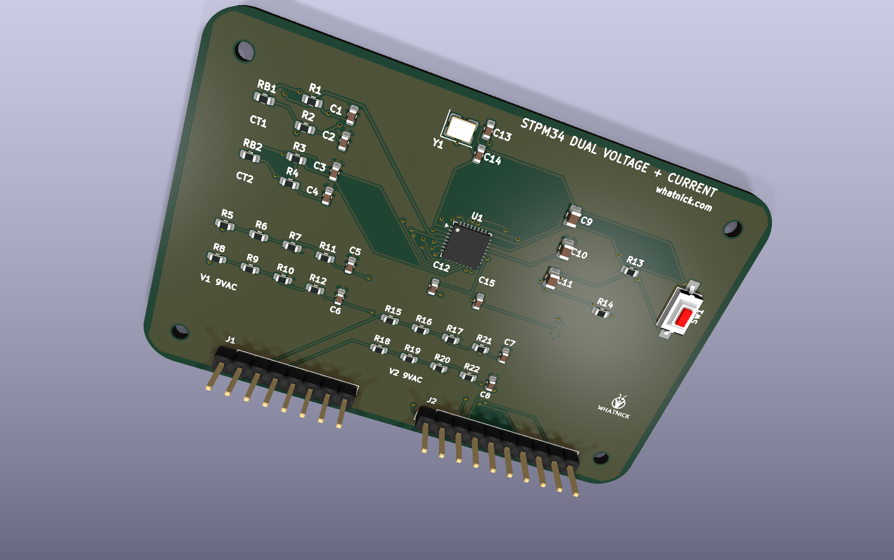
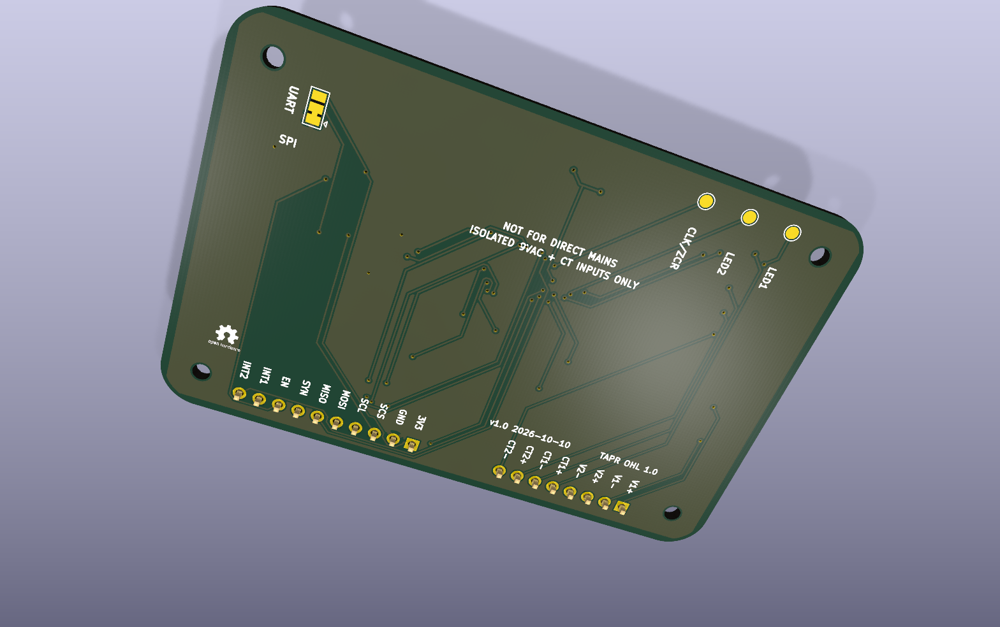

# STPM34 Breakout

KiCad 10 open-hardware breakout for the STMicroelectronics STPM34 metering
ASIC. It measures two isolated voltage channels and two current-transformer
channels for split-phase, dual-circuit, and two-phase development.





## Front end

- Supply: 3.3 V.
- Voltage inputs: two isolated 9 VAC transformer secondaries.
- Current inputs: two 100 A:50 mA CTs.
- Current burdens: 2.4 ohm differential, giving 120 mV RMS at 100 A.
- Current filters: 100 ohm series resistors and 330 nF capacitors.
- Voltage dividers: symmetric 200 kohm / 2.49 kohm per channel.
- Voltage filters: 1 kohm series resistors and 33 nF capacitors.
- Clock: 16 MHz crystal.
- Grounding: separate GNDA and DGND pours joined through NT1. NT1 is a copper
  net tie; no component is fitted there.

This is not an isolated mains-input board. Connect only isolated low-voltage
sources and follow applicable electrical-safety practices.

## Headers

J1 carries the analog inputs:

| Pin | Signal | Pin | Signal |
|---:|---|---:|---|
| 1 | V1AC_P | 5 | CT1_P |
| 2 | V1AC_N | 6 | CT1_N |
| 3 | V2AC_P | 7 | CT2_P |
| 4 | V2AC_N | 8 | CT2_N |

J2 carries power and the host interface:

| Pin | Signal | Pin | Signal |
|---:|---|---:|---|
| 1 | +3V3 | 6 | MISO/TXD |
| 2 | DGND | 7 | SYN |
| 3 | SCS | 8 | EN |
| 4 | SCL | 9 | INT1 |
| 5 | MOSI/RXD | 10 | INT2 |

Underside pads expose LED1, LED2, and CLKOUT/ZCR.

## SPI/UART selector

STPM34 supports SPI or UART, not I2C. SJ1 biases SCS through R14 at power-up:

- Pads 1-2 are closed by default, selecting SPI with a DGND bias.
- For UART, cut pads 1-2 and bridge pads 2-3 to bias SCS to +3V3.
- Press SW1 after changing SJ1 so EN is asserted low and the interface mode is
  sampled again.

## Rebuilding

Run the scripts from the repository root:

```powershell
python .\scripts\build_stpm34_schematic.py
python .\scripts\apply_stpm34_bom.py
& "C:\Program Files\KiCad\10.0\bin\python.exe" .\scripts\build_stpm34_pcb.py
```

Routing uses Freerouting with Java 25:

```powershell
$env:JAVA25 = "C:\Program Files\Eclipse Adoptium\jre-25.0.4.101-hotspot\bin\java.exe"
$env:FREEROUTING_JAR = "C:\path\to\freerouting-2.4.1.jar"
& "C:\Program Files\KiCad\10.0\bin\python.exe" .\scripts\route_stpm34.py
& "C:\Program Files\KiCad\10.0\bin\python.exe" .\scripts\finalize_stpm34_pcb.py
```

The checked-in routed PCB is the production source. Reconstruction scripts
capture the electrical design, 75 x 50 mm rounded envelope, placement,
routing workflow, ground pours, markings, and project-local 3D/logo assets.

## Manufacturing outputs

```powershell
python .\scripts\apply_stpm34_bom.py
python .\scripts\render_stpm34.py
python .\scripts\generate_stpm34_gerbers.py
```

The Elecrow BOM is written to `manufacturing`. Gerbers, separate PTH/NPTH
drills, Gerber job data, front/rear position CSVs, and the upload ZIP are
written to `gerber`. The BOM contains 17 grouped unique parts and 44 fitted
components.

## Validation

KiCad 10 ERC and DRC are mandatory before fabrication export. The Gerber
generator enforces zero ERC/DRC violations and zero unconnected items before
creating the package.
